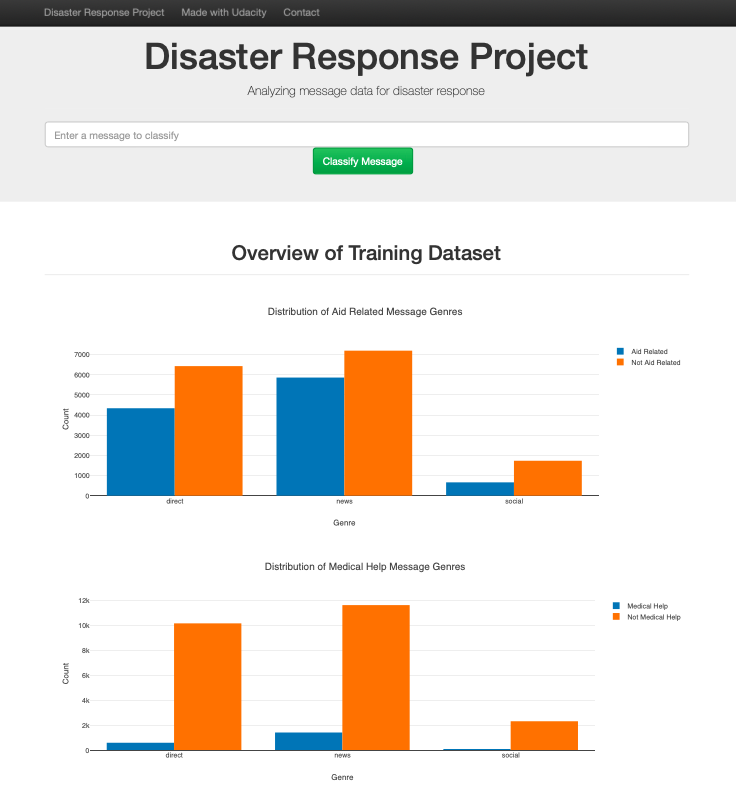

# Disaster Response Pipeline

A web app where an emergency worker can input a new message and get classification results in several categories is implemented. The disaster data is provided by [Figure Eight](https://www.figure-eight.com/) and there are three components in this project, including 1. ETL Pipeline 2. ML Pipeline 3. Flask Web App.





### File hierarchy

```txt
- app
| - template
| |- master.html  # main page of web app
| |- go.html  # classification result page of web app
|- run.py  # Flask file that runs app

- data
|- disaster_categories.csv  # data to process 
|- disaster_messages.csv  # data to process
|- process_data.py       # ETL pipeline
|- DisasterResponse.db   # database to save clean data to

- models
|- train_classifier.py   # ML pipeline
|- classifier.pkl  # saved model 

- README.md
```


### Instructions

1. Run the following commands in the project's root directory to set up your database and model.

   - To run ETL pipeline that cleans data and stores in database
     `python data/process_data.py data/disaster_messages.csv data/disaster_categories.csv data/DisasterResponse.db`
   - To run ML pipeline that trains classifier and saves
     `python models/train_classifier.py data/DisasterResponse.db models/classifier.pkl`

2. Run the following command in the app's directory to run your web app.
   `python run.py`

3. Go to http://0.0.0.0:3001/


### Project Components

#### 1. ETL Pipeline

 `process_data.py` performs a data cleaning pipeline :

- Loads the `disaster_messages` and `disaster_categories` datasets
- Merges the two datasets
- Cleans the data 
- Stores it in a SQLite database

The cleaned data will be saved in `data/DisasterResponse.db`

#### 2. ML Pipeline

`train_classifier.py` performs a machine learning pipeline :

- Loads data from the SQLite database
- Splits the dataset into training and test sets
- Builds a text processing and machine learning pipeline
- Trains and tunes a model using GridSearchCV
- Outputs results on the test set
- Exports the final model as a pickle file

The final model will be saved in `models/classifier.pkl`


#### 3. Flask Web App

- Users can input message in text box, and the web app will return how the message classified for the predefined 36 categories
- On the other hand, the web app visualizes two bar charts of overview of training dataset. One is aid related message counts classified by different genre, and the other is medical help message counts

